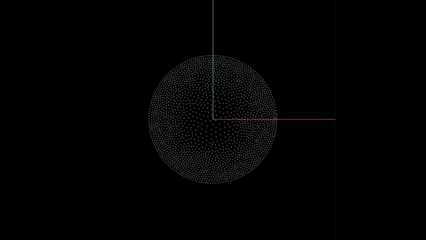
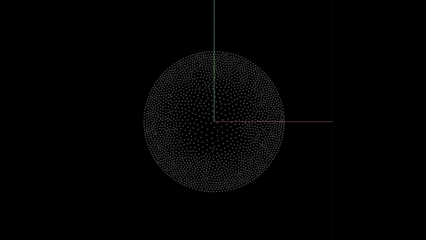

 
 

## References

This library is based on well-established particle-based fluid simulation methods:

### Position Based Dynamics (PBD)
Müller, M., Heidelberger, B., Hennix, M., & Ratcliff, J. (2007)  
*Position Based Dynamics*  
https://mmacklin.com/pbd.pdf

### Extended Position Based Dynamics (XPBD)
Müller, M., Macklin, M., et al. (2016)  
*Extended Position Based Dynamics*  
https://mmacklin.com/xpbd.pdf

### Position Based Fluids (PBF)
Macklin, M., & Müller, M. (2013)  
*Position Based Fluids*  
https://mmacklin.com/pbf_siggraph2013.pdf

### Smoothed Particle Hydrodynamics (SPH)
Monaghan, J. J. (1992)  
*Smoothed Particle Hydrodynamics*  
https://doi.org/10.1146/annurev.aa.30.090192.002431
